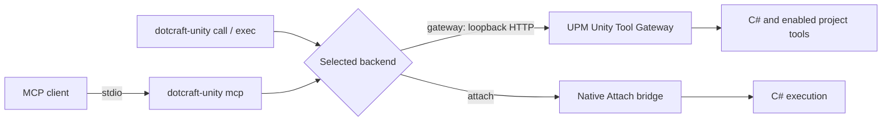

# Unity tool gateway

The `dotcraft-unity.exe` executable connects external MCP clients and one-shot CLI commands to
Unity. Gateway uses the installed UPM integration and exposes enabled custom project tools.
Attach executes C# in a Windows x64 Mono Editor without installing UPM. CLI use requires no MCP
configuration. See the [CLI reference](https://github.com/DotHarness/dotcraft-unity/blob/main/Plugins/dotcraft-unity/skills/dotcraft-unity/references/cli.md)
for backend selection and commands.



## Select the integration

Use `--backend auto`, `--backend gateway`, or `--backend attach`. Auto selects Gateway when project
discovery or cached manifest state exists, and Attach otherwise. Invalid or stale Gateway state
reports an error instead of switching to Attach. The backend is fixed before dispatch; an
uncertain operation is never replayed through another backend.

`status` and tool listing never inject. Attach status lists matching project/PID candidates, and
`--pid` selects among matching Editors. The public UPM package requires Unity 2022.3 or later.

The sections below describe the UPM Gateway. Attach lifecycle behavior is covered by the
[backend-specific reload reference](https://github.com/DotHarness/dotcraft-unity/blob/main/Plugins/dotcraft-unity/skills/dotcraft-unity/references/compilation-and-reload.md).

## Lifecycle

- The MCP host starts `dotcraft-unity.exe mcp --backend gateway --project-root <project>` and owns its stdio connection.
- The MCP Gateway uses the official `ModelContextProtocol` SDK for initialization, cancellation, tool calls, and `tools/list_changed`.
- Unity owns the private Unity Tool Gateway and its `UnityToolRegistry`.
- Restarting Unity does not restart the MCP Gateway. Calls fail while Unity is unavailable; later calls connect to the new Unity Tool Gateway.
- Interrupted calls are never replayed automatically because tools may mutate project state.
- CLI commands exit after one operation. Gateway HTTP calls have a 65-second client deadline; Attach does not inherit that overall deadline. Cancellation is cooperative and cannot roll back Unity work already started.

## CLI

The Windows x64 installer puts the latest release in `~/.craft/bin` and on the user PATH after validating the manifest, SHA-256, and executable version. It does not configure an MCP client. Command syntax, input forms, output envelopes, exit codes, and the compilation/reload workflow are in the [CLI reference](https://github.com/DotHarness/dotcraft-unity/blob/main/Plugins/dotcraft-unity/skills/dotcraft-unity/references/cli.md).

## Package and installation

The package ID is `com.dotcraft.unity`. Gateway and external compilation compatibility is determined by `protocolVersion`, not by matching package and CLI product versions.

Setup downloads the latest .NET 10 Windows x64, self-contained, single-file CLI release. It verifies the release manifest, SHA-256 digest, runtime identifier, executable version, and supported protocol before installing it under:

```text
%USERPROFILE%\.craft\bin\dotcraft-unity.exe
```

The installer adds `%USERPROFILE%\.craft\bin` to the user PATH without duplicating an existing entry. A compatible installation is shared by all projects and is left in place when one project's client configuration is removed. Missing or incompatible installations are shown as **Install CLI** or **Update CLI** in MCP Gateway Setup.

## Project state

The MCP Gateway and Unity exchange per-user state under `UserSettings/DotCraft/`. These files are not project assets and must not be committed.

- `dotcraft-unity.json` identifies the current Unity process, loopback endpoint, and one-time 256-bit token.
- `tools.json` stores the last enabled tool list and a revision derived from its canonical content.

Unity writes both files atomically. Discovery and manifests carry `protocolVersion`. The MCP Gateway accepts discovery only when that protocol is supported, the process is alive, the endpoint is loopback, and the token is present. Product versions are informational. If no valid manifest exists, it exposes only `unity_execute_csharp` until Unity publishes the current registry.

## Unity Tool Gateway contract

The Unity Tool Gateway exposes one internal operation:

```text
POST /dotcraft-unity/call
X-DotCraft-Unity-Token: <discovery token>
```

Requests must originate from loopback, use a loopback `Host`, and use a loopback `Origin` when one is present. Tool execution is dispatched to Unity's main thread.

When Gateway is selected, CLI and MCP read discovery immediately before each call. They report:

| Condition | Error code |
|-----------|------------|
| Unity is closed, reloading, or discovery is stale | `UnityUnavailable` |
| Unity disconnects after a call starts | `UnityDisconnected` |
| Unity does not respond within the client deadline | `UnityTimeout` |

The next independent call reads discovery again and can reach a newly started Unity instance.

## Client presence

Each MCP Gateway process registers itself so Unity can list the attached clients:

```text
POST /dotcraft-unity/session
X-DotCraft-Unity-Token: <discovery token>

{
  "state": "online",
  "sessionId": "9f3c1ab27d4e46f0b81c2e5a7d90cc31",
  "processId": 24188,
  "client": { "name": "claude-code", "title": "Claude Code", "version": "2.0.31" }
}
```

The route is an idempotent upsert. Unity replies with `heartbeatSeconds`, which the gateway clamps to
5-120 seconds. `client` is null until the client identifies itself during `initialize`.

A session is dropped on `"state": "closing"`, when its process id is gone, or after a 45-second TTL.
Tool calls carry the optional `X-DotCraft-Unity-Session` header so activity stays accurate between
heartbeats.

## Tool registry

`UnityToolRegistry` is the execution authority:

- **Enable C# Automation** controls `unity_execute_csharp`.
- Custom tools appear only when enabled in **Project Settings > DotCraft > Unity Tools**.
- `unity_execute_csharp` is reserved and cannot be replaced by a custom tool.
- Tool names and schemas follow the `AgentToolAttribute` contract.

When settings or loaded assemblies change the manifest revision, the MCP Gateway updates its tool collection and emits `tools/list_changed`.

## Setup

**Tools > DotCraft > MCP Gateway Setup** installs the global CLI described above and writes a project-scoped stdio server named `dotcraft-unity` for Claude Code, Codex, or Cursor, each using the absolute executable path with `mcp --backend gateway --project-root <project>`.

The private endpoint and token are never written to MCP client configuration.

## Related docs

- [Dynamic tools](dynamic-tools.md)
- [README](../README.md)
- [中文说明](../README_ZH.md)
