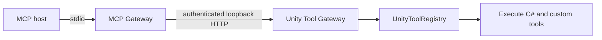

# Unity tool gateway

The MCP Gateway lets external MCP hosts call Unity Editor tools without sharing Unity's process lifetime.



## Lifecycle

- The MCP host starts `dotcraft-unity-mcp.exe` and owns its stdio connection.
- The MCP Gateway uses the official `ModelContextProtocol` SDK for initialization, cancellation, tool calls, and `tools/list_changed`.
- Unity owns the private Unity Tool Gateway and its `UnityToolRegistry`.
- Restarting Unity does not restart the MCP Gateway. Calls fail while Unity is unavailable; later calls connect to the new Unity Tool Gateway.
- Interrupted calls are never replayed automatically because tools may mutate project state.

## Package and installation

The package ID is `com.dotcraft.unity`. Package and MCP Gateway versions are identical.

Setup downloads the .NET 10 Windows x64, self-contained, single-file MCP Gateway from the GitHub Release whose tag matches the package version. It verifies the release manifest, SHA-256 digest, runtime identifier, MCP SDK version, and executable version before installing it under:

```text
%USERPROFILE%\.craft\unity\mcp-gateway\<version>\dotcraft-unity-mcp.exe
```

The installed executable is shared by projects using the same package version. Setup does not contact GitHub when that version is already installed and valid. Removing one project's client configuration does not delete it.

## Project state

The MCP Gateway and Unity exchange per-user state under `UserSettings/DotCraft/`. These files are not project assets and must not be committed.

- `dotcraft-unity.json` identifies the current Unity process, loopback endpoint, and one-time 256-bit token.
- `tools.json` stores the last enabled tool list and a revision derived from its canonical content.

Unity writes both files atomically. The MCP Gateway accepts discovery only when the schema and package version match, the process is alive, the endpoint is loopback, and the token is present. If no valid manifest exists, it exposes only `unity_execute_csharp` until Unity publishes the current registry.

## Unity Tool Gateway contract

The Unity Tool Gateway exposes one internal operation:

```text
POST /dotcraft-unity/call
X-DotCraft-Unity-Token: <discovery token>
```

Requests must originate from loopback, use a loopback `Host`, and use a loopback `Origin` when one is present. Tool execution is dispatched to Unity's main thread.

The MCP Gateway reads discovery immediately before each call. It reports:

| Condition | Error code |
|-----------|------------|
| Unity is closed, reloading, or discovery is stale | `UnityUnavailable` |
| Unity disconnects after a call starts | `UnityDisconnected` |

The next independent call reads discovery again and can reach a newly started Unity instance.

## Client presence

Each MCP Gateway process registers itself so Unity can list the attached clients:

```text
POST /dotcraft-unity/session
X-DotCraft-Unity-Token: <discovery token>

{
  "state": "online",
  "sessionId": "9f3c1ab27d4e46f0b81c2e5a7d90cc31",
  "processId": 24188,
  "client": { "name": "claude-code", "title": "Claude Code", "version": "2.0.31" }
}
```

The route is an idempotent upsert. Unity replies with `heartbeatSeconds`, which the gateway clamps to
5-120 seconds. `client` is null until the client identifies itself during `initialize`.

A session is dropped on `"state": "closing"`, when its process id is gone, or after a 45-second TTL.
Tool calls carry the optional `X-DotCraft-Unity-Session` header so activity stays accurate between
heartbeats.

## Tool registry

`UnityToolRegistry` is the execution authority:

- **Enable C# Automation** controls `unity_execute_csharp`.
- Custom tools appear only when enabled in **Project Settings > DotCraft > Unity Tools**.
- `unity_execute_csharp` is reserved and cannot be replaced by a custom tool.
- Tool names and schemas retain the existing `AgentToolAttribute` contract.

When settings or loaded assemblies change the manifest revision, the MCP Gateway updates its tool collection and emits `tools/list_changed`.

## Setup

Open **Tools > DotCraft > MCP Gateway Setup**. Setup downloads and installs the package's exact MCP Gateway version, then writes a project-scoped stdio server named `dotcraft-unity` for Claude Code, Codex, or Cursor. Each configuration passes the current project root through `--project-root`.

The setup page reports package and MCP Gateway versions, installation integrity, Unity Tool Gateway state, manifest revision, and tool count. It can restart the Unity Tool Gateway or install, update, and remove client configuration. The private endpoint and token are never written to MCP client configuration.

## Related docs

- [Dynamic tools](dynamic-tools.md)
- [README](../README.md)
- [中文说明](../README_ZH.md)
