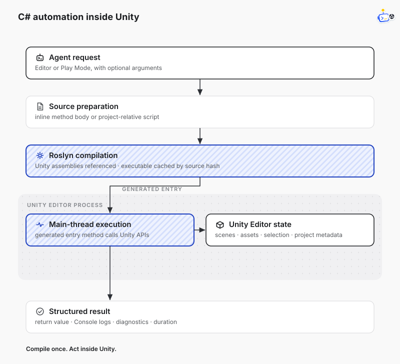

<div align="center">


[中文](./README_ZH.md) · [DotCraft](https://github.com/DotHarness/dotcraft) · [ACP](https://agentclientprotocol.com/) · [License](https://github.com/DotHarness/dotcraft-unity)

Use coding agents with Unity Editor.

Chat with an agent inside Unity, or expose Unity tools to DotCraft, Claude Code, Codex, Cursor, and other agents.

</div>

## What you can do

| Workflow | Use this when | Entry point |
|----------|---------------|-------------|
| In-Unity Agent Chat | You want to chat with DotCraft or another ACP agent inside Unity | **Tools → DotCraft → AI Assistant** |
| MCP Gateway | You want external MCP clients such as Claude Code, Codex, or Cursor to call Unity tools | **Tools → DotCraft → MCP Gateway Setup** |
| C# Automation | You want an agent to perform batch operations in Unity | `unity_execute_csharp` |
| Custom Tools | You want to expose project-specific Unity tools | `[AgentTool]` |

## Quick Start

### Install the Unity package

Open **Window → Package Manager** and add this Git URL:

   ```text
   https://github.com/DotHarness/dotcraft-unity.git
   ```

Minimum Unity version: **2021.3**, recommended version: **Unity 6**.

### Option A: Chat inside Unity


1. Install dotcraft-unity from Package Manager.
2. Open **Tools → DotCraft → AI Assistant**.
3. Select **DotCraft** or **Custom ACP Agent** in **Project Settings → DotCraft**.
4. Click **Connect**.

### Option B: Use MCP to operate Unity


1. Open the Unity project.
2. Enable **Unity Tool Gateway** in **Project Settings → DotCraft**.
3. Run **Tools → DotCraft → MCP Gateway Setup**.
4. Choose your client: Claude Code, Codex, or Cursor.
5. Start your coding agent from the project root.

### Option C: Add project-specific tools

1. Create a static Editor method marked with `[AgentTool]`.
2. Let Unity compile.
3. Enable the tool in **Project Settings → DotCraft → Unity Tools**.
4. Use it from DotCraft or any MCP client connected through the MCP Gateway.

## MCP Gateway


dotcraft-unity provides a stable MCP Gateway for coding agents, unaffected by domain reloads or editor restarts.

See [Documentation~/tool-gateway.md](./Documentation~/tool-gateway.md) for more details.

## Built-in tools

dotcraft-unity provides one built-in Unity runtime tool based on Roslyn:



| Tool | Description |
|------|-------------|
| `unity_execute_csharp` | Compile and execute a C# method-body snippet in the Unity Editor process. |

Use `unity_execute_csharp` to read or modify scene state, selected objects, Console output, project metadata, and assets with C# snippets.

## Custom tools

Unity Editor code can expose custom project tools by marking static methods with `AgentToolAttribute`. 

New custom tools are discovered in **Edit → Project Settings → DotCraft → Unity Tools**, default to disabled.

```csharp
using System.ComponentModel;
using DotCraft.Editor.Protocol;
using DotCraft.Editor.RuntimeTools;

public static class ExampleDotCraftTools
{
    [Description("Return a greeting from an example Unity plugin.")]
    [AgentTool(Namespace = "example", Name = "example_greet", Kind = AcpToolKind.Read)]
    public static object Greet([Description("Name to greet.")] string name = "Unity")
    {
        return new { message = $"Hello, {name}." };
    }
}
```

See [Documentation~/dynamic-tools.md](./Documentation~/dynamic-tools.md) for more details.

## Agent integrations

dotcraft-unity provides a shared automation skill for external agents and a direct ACP integration for DotCraft.

### Agent plugins

The repository publishes the same Unity automation skill as both a DotCraft plugin and a Codex plugin. Configure the MCP Gateway separately in Unity so an installed plugin can call the tools covered by the skill.

For DotCraft:

1. Open **Plugins** in DotCraft.
2. Open the menu beside **Create**, then select **Add marketplace**.
3. Enter `DotHarness/dotcraft-unity` as the marketplace source.
4. Add the marketplace, then install **DotCraft Unity**.

For Codex, add `DotHarness/dotcraft-unity` as a plugin marketplace, then install **DotCraft Unity** from that marketplace.

### ACP Extension

When using DotCraft as the ACP server, you do not need an MCP service. Built-in tools and custom tools are passed to the session through ACP extensions, reducing context overhead for non-Unity sessions.

## License

Apache License 2.0
