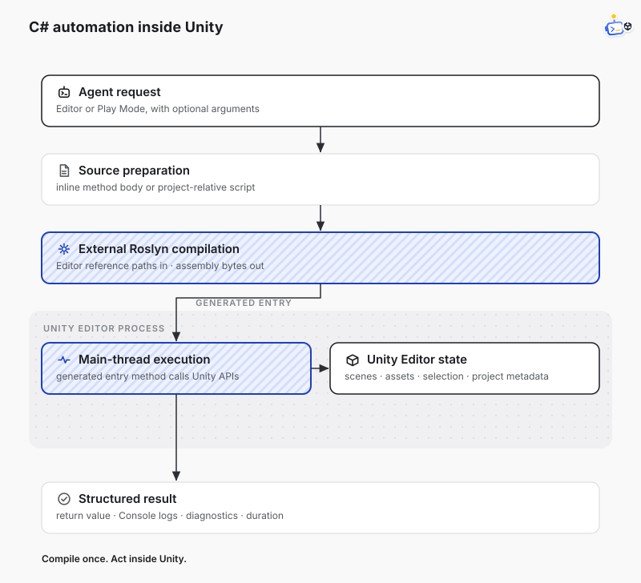

<div align="center">


[English](./README.md) · [DotCraft](https://github.com/DotHarness/dotcraft) · [ACP](https://agentclientprotocol.com/) · [License](./LICENSE)

面向 Unity Editor 的统一 Agent 集成：支持 Unity 内对话、CLI/MCP 自动化，以及 Windows 上无需安装 UPM 包的 Attach。

</div>

## 你可以用它做什么

| 工作流 | 适用场景 | 入口 |
|--------|----------|------|
| Unity 内 Agent 对话 | 想直接在 Unity 中和 DotCraft 或其他 ACP agent 对话 | **Tools → DotCraft → AI Assistant** |
| DotCraft 原生插件 | 想直接从 DotCraft 操作 Unity | 从 DotCraft 官方插件市场安装 **Unity** |
| MCP Gateway | 想让 Claude Code、Codex、Cursor 等外部 MCP client 调用 Unity 工具 | **Tools → DotCraft → MCP Gateway Setup** |
| CLI 与 Attach | 想从终端自动化 Unity，或在不安装 Unity Package 的情况下连接 Editor | `dotcraft-unity exec` / `dotcraft-unity call` |
| 自定义工具 | 想暴露项目专属 Unity 工具 | `[AgentTool]` |

## 快速开始

### 安装 Unity Package

Unity 内对话、MCP Gateway 和自定义项目工具需要安装 Unity Package。只使用 Windows x64 Mono Attach 时，可以直接跳到**方式 C**。

打开 **Window → Package Manager**，添加这个 Git URL：

```text
https://github.com/DotHarness/dotcraft-unity.git?path=/Packages/com.dotcraft.unity
```

最低 Unity 版本：**2022.3**。

### 方式 A：在 Unity 内聊天


1. 打开 **Tools → DotCraft → AI Assistant**。
2. 在 **Project Settings → DotCraft** 中选择 **DotCraft** 或 **Custom ACP Agent**。
3. 点击 **Connect**。

### 方式 B：通过 MCP 操作 Unity


1. 在 **Project Settings → DotCraft** 中启用 **Unity Tool Gateway**。
2. 运行 **Tools → DotCraft → MCP Gateway Setup**，选择 Claude Code、Codex 或 Cursor。
3. 从项目根目录启动你的 coding agent。

### 方式 C：无需 MCP，直接通过 CLI 操作 Unity

Windows x64 用户在 Unity 项目根目录运行：

```powershell
irm https://github.com/DotHarness/dotcraft-unity/releases/latest/download/install.ps1 | iex
dotcraft-unity exec --code 'return Application.unityVersion;' --json
```

脚本执行、自定义项目工具和连接选项参阅 [CLI 使用说明](./Plugins/dotcraft-unity/skills/dotcraft-unity/references/cli.md)。

### 方式 D：添加项目自定义工具

1. 创建一个带 `[AgentTool]` 的静态 Editor 方法。
2. 等待 Unity 编译。
3. 在 **Project Settings → DotCraft → Unity Tools** 中启用这个工具。
4. 从 DotCraft、MCP client 或 `dotcraft-unity call` 使用它。

## MCP Gateway


使用 **Tools → DotCraft → MCP Gateway Setup**，将支持 MCP 的 coding agent 连接到当前项目已启用的 Unity 工具。

配置和生命周期说明参阅 [Unity Tool Gateway](./Documentations/tool-gateway.md)。

## C# 自动化

`unity_execute_csharp` 在运行中的 Unity Editor 内执行 C# snippet 或已保存的脚本。它可以检查或修改场景、选中对象、Console 输出、项目元数据和资源。



## 自定义工具

给静态 Editor 方法添加 `[AgentTool]` 即可。新工具会显示在 **Project Settings → DotCraft → Unity Tools**，默认关闭，需手动启用。

```csharp
using System.ComponentModel;
using DotCraft.Editor.Protocol;
using DotCraft.Editor.RuntimeTools;

public static class ExampleDotCraftTools
{
    [Description("Return a greeting from an example Unity plugin.")]
    [AgentTool(Namespace = "example", Name = "example_greet", Kind = AcpToolKind.Read)]
    public static object Greet([Description("Name to greet.")] string name = "Unity")
    {
        return new { message = $"Hello, {name}." };
    }
}
```

完整约定参阅 [自定义项目工具](./Documentations/dynamic-tools.md)。

## Agent 集成

### 插件

DotCraft 和外部 coding agent 使用不同的插件：

- **Unity**（`DotCraft.Unity`）是 DotCraft 原生插件。安装后即可使用 `unity.*` 工具，无需向项目添加 Unity Package。
- **DotCraft Unity**（`dotcraft-unity`）是服务于 MCP 和 CLI 工作流的 Agent skill 插件。在 Codex 中添加 `DotHarness/dotcraft-unity` plugin marketplace，然后安装 **DotCraft Unity**。

在 DotCraft 中打开 **Plugins**，选择官方市场（`DotHarness/dotcraft-plugins`），然后安装并启用 **Unity**。

### ACP 扩展

在 Unity 中选择 DotCraft 作为 ACP Server 后，可以直接在对话中使用内置工具和自定义项目工具，无需配置 MCP。

## License

[Apache License 2.0](./LICENSE)
